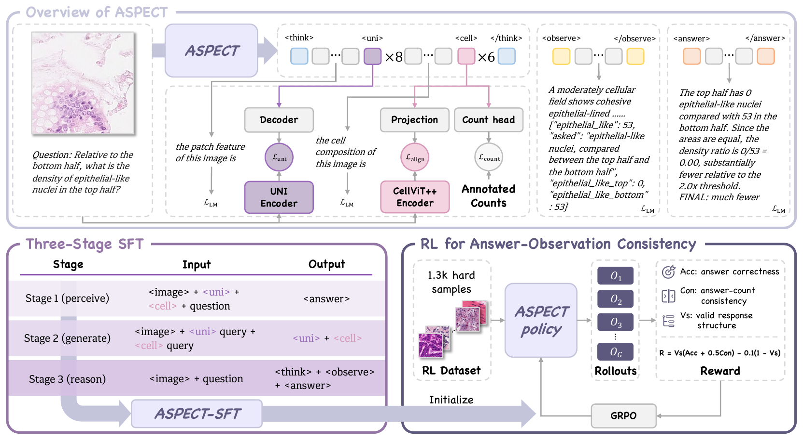

# ASPECT: Pathology Vision-Language Model with Verifiable Cell Observations

<p align="left">
  <a href="https://huggingface.co/Mikezcy/ASPECT-8B"></a>
  <a href="https://huggingface.co/datasets/Mikezcy/PathoVernier"></a>
  
</p>

## Introduction📝

ASPECT is a pathology vision-language model that answers questions about H&E images together with
the nucleus counts that support its answer. It extends Qwen3-VL-8B with 8 pathology-feature tokens
and 6 cell tokens and is trained in three supervised stages (Perceive, Generate, Reason) followed by
GRPO with an answer–observation consistency reward.

We also release **PathoVernier**, a benchmark of 759 questions on 553 H&E patches that require counting
nucleus types in image regions. Reference counts come from expert nucleus annotations, so both the final
answer and the reported counts can be checked.

<p align="center">
  
</p>

## TODOs📌

- [x] Inference and PathoVernier evaluation code
- [x] ASPECT-8B weights (gated)
- [x] PathoVernier benchmark (gated)
- [ ] Paper
- [ ] Training code

## Installation🛠️

```bash
git clone https://github.com/ChyaZhang/ASPECT.git
cd ASPECT
conda create -n aspect python=3.11 -y
conda activate aspect
pip install -r requirements.txt
```

The model and the benchmark are gated on Hugging Face. Request access on the model and dataset pages,
then log in with `hf auth login`.

## Inference🏃

```python
import torch
from PIL import Image
from aspect.inference import load, generate

model, processor = load("Mikezcy/ASPECT-8B")
question = (
    "Single out the region of maximal lymphocytic nuclear concentration, then give the lymphocytic "
    "fraction of nuclei within it. (upperleft = the upper-left quadrant; upperright = the upper-right "
    "quadrant; lowerleft = the lower-left quadrant; lowerright = the lower-right quadrant)\n"
    "For the share, use these bands: 'low' below 0.35, 'high' at or above 0.55, otherwise 'mid'."
)
print(generate(model, processor, Image.open("images/example_puma.png"), question))
```

or from the command line:

```bash
python -m aspect.inference --image images/example_puma.png --question "..."
```

Example output (`images/example_puma.png`, from PUMA, CC0). Reference counts: upper-left 12, upper-right 3, lower-left 6, lower-right 6; 12 of 13 nuclei in the upper-left quadrant are lymphocytes, so the reference answer is `upperleft:high`.

```
<think> the patch feature of the image is <|anchor_start|><|uni_pad|><|uni_pad|><|uni_pad|><|uni_pad|><|uni_pad|><|uni_pad|><|uni_pad|><|uni_pad|><|anchor_end|>, and the cell composition of the image is <|anchor_start|><|cell_pad|><|cell_pad|><|cell_pad|><|cell_pad|><|cell_pad|><|cell_pad|><|anchor_end|>. </think>
<observe>A moderately cellular field shows discohesive tumor cells with pleomorphic hyperchromatic nuclei in a loose stroma, accompanied by a prominent lymphocytic infiltrate and scattered other inflammatory cells. {"tumor": 5, "lymphocyte": 27, "inflammatory_other": 7, "asked": "lymphocytic nuclei — first locate their densest region, then give their share of all nuclei there", "upperleft": 12, "upperright": 4, "lowerleft": 7, "lowerright": 4, "_num": 12, "_den": 13}</observe>
<answer> Lymphocytic nuclei are most concentrated in the upper-left quadrant, with 12 compared with 4, 7, 4 elsewhere. Against 13 total nuclei in the region, the corresponding lymphocytic share is 12/13 = 0.92 and is therefore high.
FINAL: upperleft:high </answer>
```

Images are resized to 512x512 and answered with greedy decoding (at most 512 new tokens), without a
system prompt. The question should state the answer options.

## Evaluation on PathoVernier📊

1. Download the benchmark (after access is granted) and rebuild the images from the original datasets:

```bash
hf download Mikezcy/PathoVernier --repo-type dataset --local-dir PathoVernier
python PathoVernier/reconstruct_images.py --lizard <Lizard> --pannuke <PanNuke> --consep <CoNSeP> \
    --puma <PUMA> --nucls <NuCLS> --out PathoVernier/images
```

2. Run ASPECT-8B and score the responses:

```bash
BENCH=PathoVernier/pathovernier.jsonl IMAGES=PathoVernier/images NUM_SHARDS=4 bash scripts/eval_pathovernier.sh
```

The script shards the questions over GPUs, checks that all 759 questions are answered, and reports:

| Metric | Definition |
|---|---|
| Acc | final-answer accuracy over all 759 questions |
| CA | agreement between the decision implied by the reported counts and the reference answer (questions where that decision is determinable) |
| RAWR | 1 − mean fraction of required counts within max(1, 0.1q), over correct answers that report all required counts (lower is better) |
| Count Acc | mean fraction of required counts within tolerance over all questions |

Expected results for ASPECT-8B:

| Model | Acc ↑ | CA ↑ | RAWR ↓ | Count Acc ↑ |
|---|---:|---:|---:|---:|
| ASPECT-8B | 0.746 | 0.809 | 0.489 | 0.461 |

To score responses from another model, write one JSON object per question with `item_id`, `pred`,
`correct` and the full response in `raw` (counts inside `<observe>{...}</observe>`), then run
`python -m aspect.score_pathovernier <file> --bench PathoVernier/pathovernier.jsonl`.

## Acknowledgements✨

ASPECT builds on [Qwen3-VL](https://github.com/QwenLM/Qwen3-VL). Training targets use
[UNI](https://huggingface.co/MahmoodLab/UNI) and [CellViT++](https://github.com/TIO-IKIM/CellViT-plus-plus),
and reinforcement learning uses [verl](https://github.com/verl-project/verl). PathoVernier is derived
from Lizard, PUMA, PanNuke, CoNSeP and NuCLS; we thank their authors for releasing these datasets.

## Citation❤️

Coming soon.

## License

Code, model weights and benchmark annotations are released under
[CC BY-NC-SA 4.0](LICENSE) for non-commercial research use. ASPECT is not a medical device and must not
be used for clinical decision-making.
